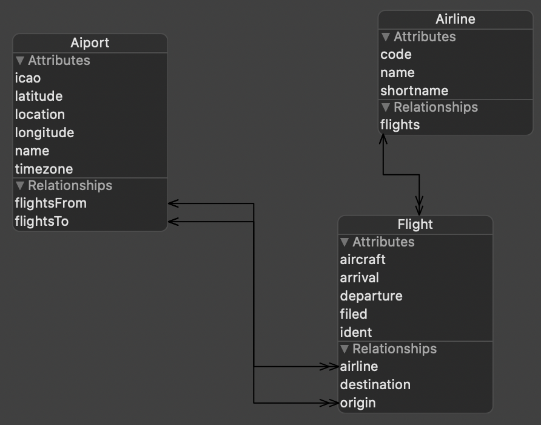

# 12 Core Data

- CS193P
- Spring 2020
- https://cs193p.sites.stanford.edu/
- https://www.youtube.com/watch?v=fCfC6m7XUew

## Topics

- Core Data
- Objected Orienten Programming
- Obtener y guardar objetos, clases, data en base de datos
- SQL vs OOP
  - SQLK es un lenguaje. Es muy diferente
  - Tiene una sintáxis
- Core data guarda la data en SQl, pero se manipula de una forma orientada a objetos

## Map

- Corazón de Core Data
- Hay un mape entre objetos, variables y tablas y filas de una base de datos relacional
- Xcode tincluye un editor de este map
- Gráficamente se puede crear las relaciones entre los objetos
- Xcode crea las clsases para los objetos y varaibles que se esepecifican en el map
- Se pueden usar extensiones y varaibles procesada para trabajar con esas clases
- Estos objetos pueden servir como fuentes de datos para los elementos de la UI

## Características

- Crear objetos
- Cambiar las variables, de los objetos (incluso las relaciones entre objetos)
- Guardar objhetos
- Obtener los objetos según ciertos criterios

## Integración con SwiftUI

- Los objetos creados en la base de datos son @ObservableObjects: MiiniViewModels
- @FetchRequest, obtiene los objetos
  - Es una consulta, un query, 
- Así se mantiene la UI siempre actualizada y sincronizada según los datos de la db

## Setup

- Al crear un proyecto, seleccionar Core Data. Esto genera:
  - Crea un blank map para el proyecto
  - Agrega un poco de código en el archivo AppDelegate para crear el almacén de la base de datos
  - Agrega líneas de codigo a SceneDelegate
    - La primera línea es una ventana para acceder a los objetos de la base de datos
      - NSManagedObjectContext
    - La segunda linea pasa un contexto al @Environiemnt de las vistas de SwiftUI

## The Map


## Códigos de ejemplo 


````swift
// Guardar
@Environment(\managedObjectContext) var context
let flight = Flight(context:context)
flight.aircraft = "B737"
let ksjc = Airport(context:context)
ksjc.icao = "KSJC"
flight.origin = ksjc //Agrega flight to ksjc.flightsFrom, una relación
try? context.save(0)
// Obtener un elemento de tipo Flight
let request = NSFetchRequest<Flight>(entityName:"Flight")
request.predicate = NSPredicate(format:"arrival < %@ and origin %@", Date(), ksjc)
// Date y el origin son variables que se pasan
request.sortDescriptors = [NSSOrtDescriptor(key: "ident", ascending:true)]
//Obtener flights según el predicate
let flights = try? context.fetch(request)
// flights será nil si falla, si no será un arreglo de Flight.
````

## SwiftUI

- Integración a la vista

````swift
@ObservedObject var flight: Flight
// Y ahora sí se puede usar los valores del objetos
Text(flight.ident)

````

- Los ObservedObjects no gatillan automáticamente objectWillChange.send(0)

````swift
@FetchRequest(entity:sortDescriptors:predicate) var flights:FetchedResults<Flight>	

@FetchRequest(fetchRequest:) var airports: FetchedResults<Airport>
FetchedResults<Flight>
//Collection, no array, de objetos Flight/Airports
````

- Flights y Airports continuamente se actualizarán segun los cambios de la base de datos

````
ForEach(flights) { flight in 
	// UI for a flight built using flight
}
````

- Si un flight es guardado en la base de datos, y hace match con el **predicate** del **FetchRequest**, el **ForEach** inmediatamente **recreará la vista** porque flights se actualizará

- Se puede inicializar un FetchRequest haciendo

````
_flights = FetchRequest(...)
// en un init
````

## CoreData

- Las propiedades de  un objeto Coredata, en un objeto Swift, se usarán como optionals

