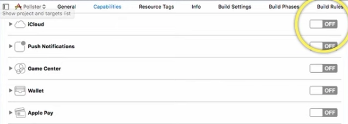
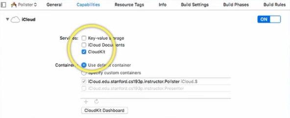
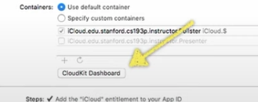
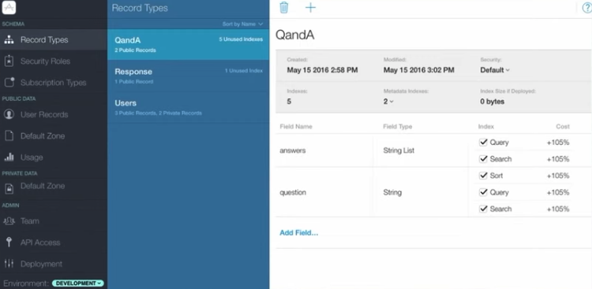

# 13 Persistence

- CS193P
- Spring 2020
- https://cs193p.sites.stanford.edu/
- https://www.youtube.com/watch?v=fTNPRhGGP-0

## Topics

- UserDefaults
- Codable/JSON
- UIDocument
  - Integra files app
  - Documentos de usuario
  - Documentos de verdad
  - Basado en UIKit
- Core Data
  - Power
  - Object Oriented
  - Elegante integración con SwiftUI a través de @FetchRequest
- Cloud Kit
  - Almacenar data en iCloud
  - Esta data aparecerá en todos los equipos del usuario
  - También tiene un UserDefaults en la red
  - Y funciona bien con Core Data
- FileManager/URL/Data
  - Almacnear cosas en disco
  - En sistema de archivos del dispositivo

## Cloud Kit

- Base de datos en la nube
- Es una base de datos simple
- El acceso puede ser lento y asíncrono
  - Revisar demo de Spring of 2015/16S en iTunesU

### Componentes Importantes

- Record Type: Class o Struct
- Fields: Algo así como variables de la clase
- Record: Instancia de un registro
- Reference: Puntero hacia un registro. Entre objetos
- Zone: una sub área de la base de datos
- Container: Colección de bases de datos
- Query: Búsqueda en la base de datos. Criteria
- Subscription: 
  - Standing Query
  - La cual envía notificaciones cuando hay cambios en iCloud. 
  - Sirve para notificar que el cambio se realizado en iCloud 
  - El dispositivo manejará la notificaciones

### Activar en proyecto

- Se debe activar en el proyecto





- Dashboard de actividades de iCloud



- Dashboard en internet
  - Se marcan que cosas uno quiere consultar
  - Se pueden agregar record types



- Es algo así como un map
- Se puede crear dinámicamente on the fly o en el dashboard

#### Crear un registro en Cloud Kit

```swift
let db = CKContainer.default.public/shared/privateCloudDatabase
//private es la databse normal
//public si se pone data, otros usuarios, pueden ver la data
//shared sólo se puede entrar y ver los datos con invitación enviada por email
let tweet = CKRecord("Tweet")
// Tweet es el nombre del tipo de record
// Creará un record en iCloud Dashboard
tweet["text"] = "Texto a guardar en el registro Tweet"
let tweet = CKRecord("TwitterUser");
tweet["tweeter"] = CKReference(record:tweeter, action:.deleteSelf)
db.save(tweet) { (saveRecord:CKrecord?, error:NSError?) -> Void in 
    if error == nil {
         //Guardado OK
   } else if error?.errorCode ==CKErrorCode.NotAuthenticated.rawValue {
        // Se debe loguear el usuario
    } else {
        // Revisar otros 29 CKErrorCodes!  
    }
}
```

#### Querings, consultando registros en la base de datos

```swift
let predicate = NSPredicate(format: "text contains %@", searchString);
let query = CKQuery(recordType:"Tweet", predicate:predicate);
db.perform(query) { records:[CKRecord]?, error: NSError?) in 
  if error == nil {
    // Array de tipo CKRecords
  } else if error?.errorCode == CKErrorCode.NotAuhenticated.rawValue {
    // Informar que se debe loguear  
  } else {
    // Revisar otros 29 CKErrorCodes!  
  }  
}
```

#### Standing Queries (Subscription)

- Ocurre en el servidor
- Una vez que el cambio se ejecuta, se envia una notificación
- Enviar notificaciones al ocurrir cambios

## File System

- Empieza en ./
- Es como Unix
- Hay protecciones, no se pueden ver o modificar archivos como Unix
- Es un sandbox, isolado, aislado, y sólo se pueden leer y escribir ahí

### ¿Por qué sandbox?

- Seguridad: así nadie destruye la aplicación
- Privacidad: Otras aplicaciones no pueden ver la data de otra aplicación
- Limpieza: Al eliminar una aplicación, todo se limpia

#### ¿Qué hay en sandbox?

- Application directory: 
  - Ejecutable, JPGs, etc. Sólo lectura. 
- Documents directory: 
  - Se guarda lo que el usuario quiere guardar. Storage permanente
  - Siempre visible para el usuario
- Application Support directory: 
  - Storage permanente no visible para el usuairo
- Caches Directory: 
  - Storage temporal
  - No se respalda en iCloud
- Others directories:  (Ver documentación) 

### Uso con URL

#### Obgtener una ruta

- FileManager
  - con URL

```swift
let url:URL = FileMananger.default.url(
    for directory: FileManager.SearchPathDirectory.documentDirectory,
    in domainMask: .userDomainMask // Siempre será .userDomainMask en iOS
    appropiatedFor: nil, //importante al reemplazar archivos
    create: true
)
```

- Siempre se ejecuta en el main queue. 
  - No bloquea a no ser que sea un archivo gigante
- Métodos URL

```swift
func appendingPathComponent(String) -> URL
func appendinPathExtension(String) -> URL
```

#### Que es lo que hay al final de la URL

```swift
var isFileURL: Bool //exista o no
func resourcesValues(for keys:[URLResouceKey]) throws -> [URLResourceKey:Any]?
```

- Arreglo con llaves que se necesitan pedir
  - .creationDateKey
  - .isDirectoryKey
  - .fileSizeKey

### Uso con Data

- Leer un binario desde una URL

- Leer archivos desl disco

```swift
init (contentsOf: URL, options: Data.readingOptions) throws
```

- Las opciones generalmente son []
- Esta función arroja un error

```
func write(to url:URL, options: Data.WritingsOptions) throws -> Bool
```

- Estas son atómicas. Si al tratar de guardar un archivo muy grande, el disco se aqueda isn espacio, se reversará
- .whitoutOverwriting

### FileManager

- Permite trabajar con los archivos
- Revisar si existe

```
fileExists(atPath: String) -> Bool
```

- Mover un archivo a otra ubicación
- Enumar directorios
- Mover
- Copiar
- Borrar
- Tiene un delegate, que llamará funciones cuando las cosas sucedan

## Demo

- EmojiArt
- Guartdar los documentos en disco y no en UserDefaults

### 